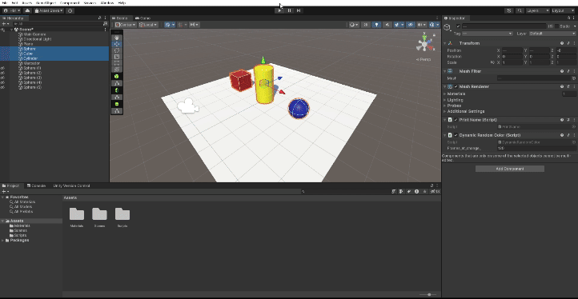
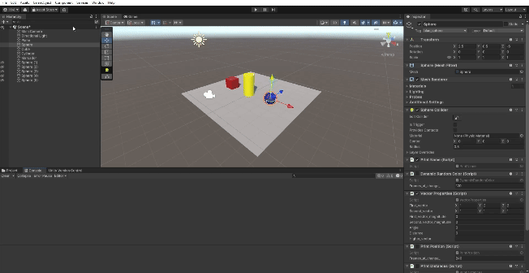
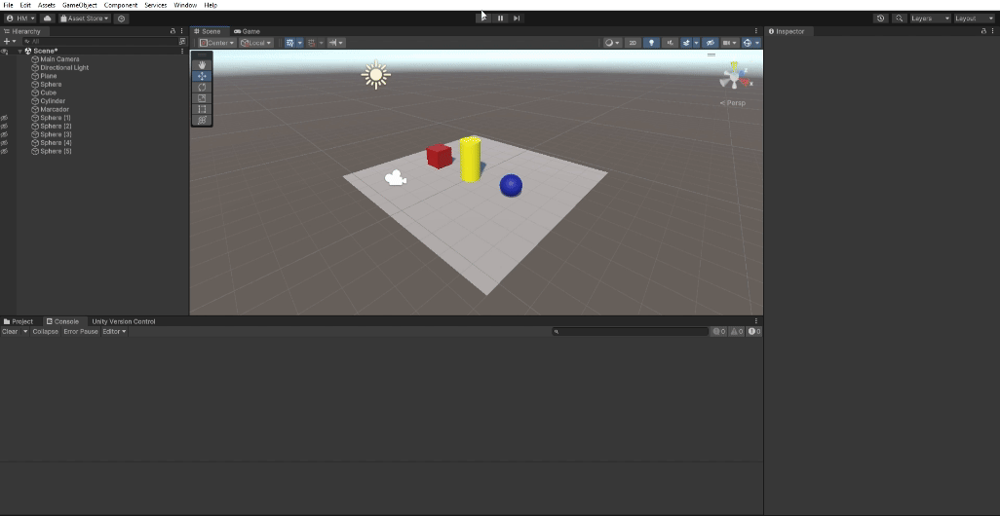
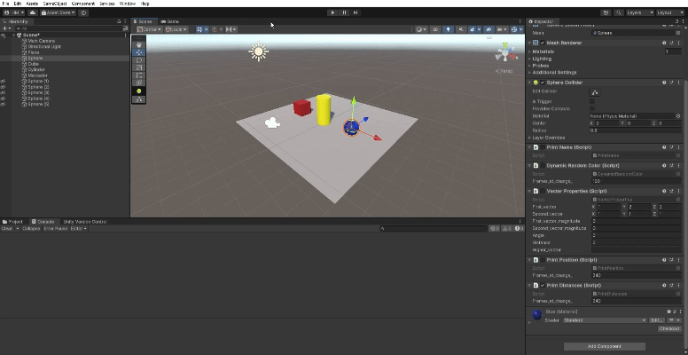
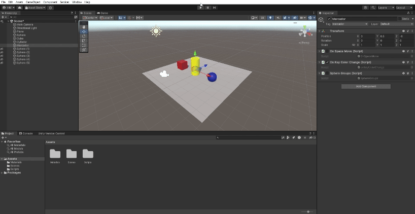
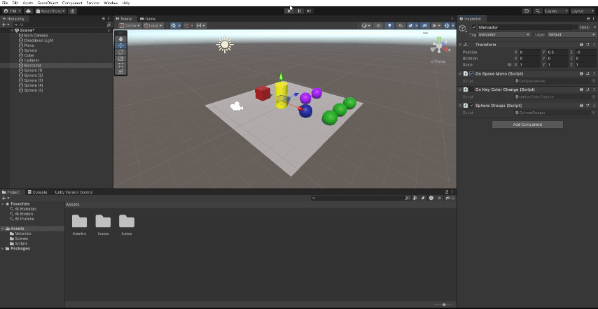

# Interfaces Inteligentes

- Hugo Hernández Martín (alu0101481227@ull.edu.es)

# Práctica 2: Introducción a C# y Scripts

En la presente práctica se han desarrollado diferentes ejercicios con el objetivo de introducirnos al uso del lenguaje de programación C# y la incorporación del mismo a los Scripts de Unity.

## Ejercicio 1: Cambio a color aleatorio cada 120 frames

El primer ejercicio consiste en realizar un programa que cambie el color de algún objeto, en este caso una esfera, un cubo y un cilindro. Para ello se ha hecho uso de la clase Random de Unity, del componente Renderer de los GameObject y de la clase Color de Unity. Además, es destacable que se ha dejado un atributo público en el Script que representa el número de frames que pasan para que se vuelva a cambiar el color a las figuras. Ésto se ha hecho con el fin de poder modificar el parámetro desde el inspector de Unity, como se observa a continuación:

[Código del Script del Ejercicio 1](Scripts/DynamicRandomColor.cs)

## Ejercicio 2: Creación de Escena e impresión de nombre por consola

En el segundo ejercicio se especifica que la escena creada ha de tener un plano, un cubo, una esfera y un cilindro. A todos los objetos se les asocia un material diferente (contenido en una carpeta Materials dentro de la carpeta Assets). Además, se añade a cada objeto un pequeño script que muestra su nombre (propiedad *name*).

[Código del Script del Ejercicio 2](Scripts/PrintName.cs)

## Ejercicio 3: Vector3 y sus métodos

En este ejercicio se han creado dos variables Vector3 públicas para que sean accesibles desde el inspector de Unity. Se han calculado diferentes operaciones (métodos de la clase Vector3) y se muestra el resultado en la consola y en el inspector.

[Código del Script del Ejercicio 3](Scripts/VectorProperties.cs)

## Ejercicio 4: Mostrar posición por consola

En la presente actividad se propone mostrar por pantalla el vector de posición de la esfera. Para ello, únicamente hay que acceder al atributo *position* del componente *Transform* de la esfera. Se ha usado la sección **Update** para que el presente Script arroje resultados correctos si se usa en conjunto con otros Scripts de esta misma práctica que implican desplazamientos de objetos.

[Código del Script del Ejercicio 4](Scripts/PrintPosition.cs)

## Ejercicio 5: Cálculo de distancias entre diferentes objetos

En el ejercicio se pide mostrar las distancias existentes desde la esfera al cubo y al cilindro. Para calcular la distancia se usa el método de Vector3 *Distance* que recibe los vectores de posición de las dos figuras de interés y retorna la distancia entre ellas.

[Código del Script del Ejercicio 5](Scripts/PrintDistances.cs)

## Ejercicio 6: Traslación de objetos a nuevas posiciones al pulsar una tecla

En el presente ejercicio se pide realizar una traslación de las figuras de la escena definiendo el movimiento deseado en un Vector3. Para ello, además de la clase Vector3, se usa la clase Input de Unity y se crea un elemento invisible al que se asociará el script (por lo tanto, será necesario obtener los objetos mediante su tag o nombre). Es destacable mencionar que en mi versión del script cambio los vectores de desplazamiento de signo cada vez que se ejecuta, para que se alterne entre dos posiciones (la original y la nueva).

[Código del Script del Ejercicio 6](Scripts/OnSpaceMove.cs)

## Ejercicio 7: Cambiar color de objetos al pulsar teclas

El presente ejercicio plantea que se cambie el color del cilindro al presionar la tecla **C** y el color del cubo al presionar la tecla **flecha arriba**. Para ello, se vuelve a hacer uso del elemento invisible creado en el ejercicio anterior para asociar el script, además se usan la clases de Unity *Input* (detectar tecla pulsada), *Color* (almacenar un color) y *Random* (generar un color aleatorio). Como en el ejercicio 1, se modifica la propiedad *color* del material obtenido del componente *Renderer* de los GameObject.

[Código del Script del Ejercicio 7](Scripts/onKeyColorChange.cs)

## Ejercicio 8: Modificar escala y color según distancia entre diferentes objetos

En este último ejercicio se crean 5 esferas más, a dos de ellas se les asigna una etiqueta *grupo_1* y a las tres restantes la etiqueta *grupo_2*. Sobre el segundo grupo mencionado se calcularán las esferas más cercana y más lejana al cubo. A la esfera más cercana al cubo se le aumentará la altura (modificando la propiedad *localScale* de la propiedad *transform* del GameObject). A la esfera más lejana se le cambiará el color cada vez que se presione la tecla **espacio**. Es importante destacar que el Script desarrollado es reactivo a movimientos, es decir, si se desplazan el cubo o las esferas, se cambiarán las acciones si es necesario.

[Código del Script del Ejercicio 8](Scripts/SphereGroups.cs)

## Modificación

